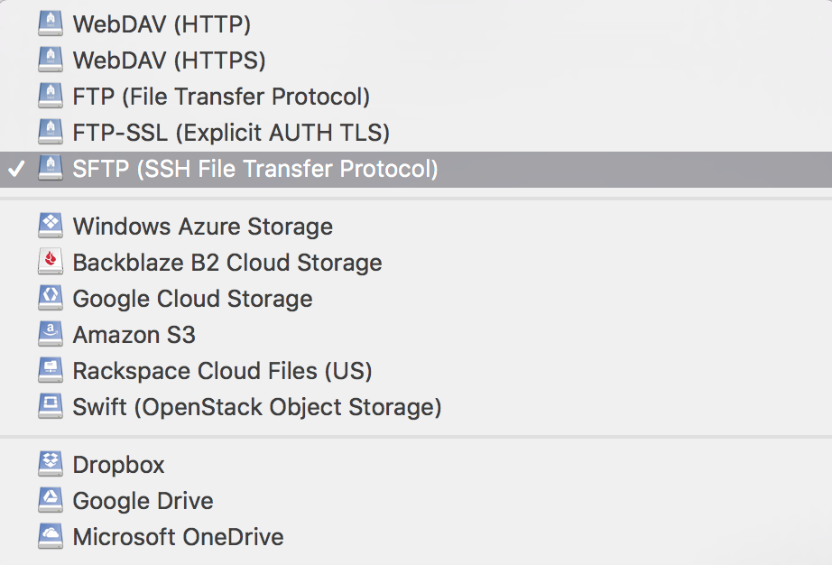
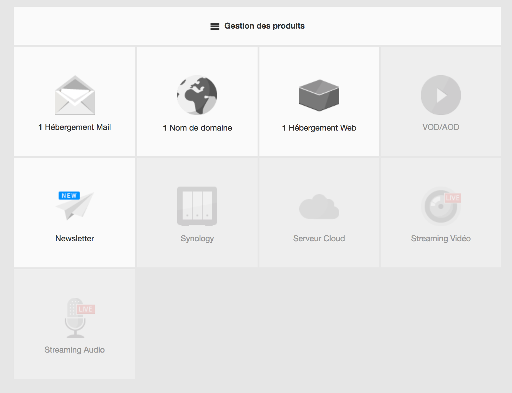
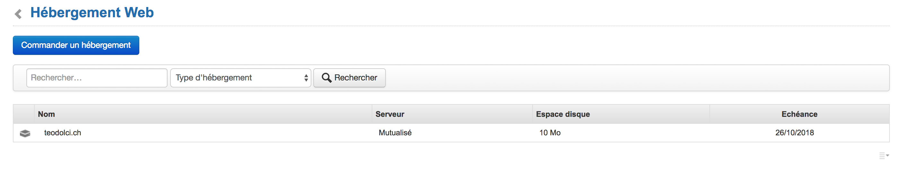
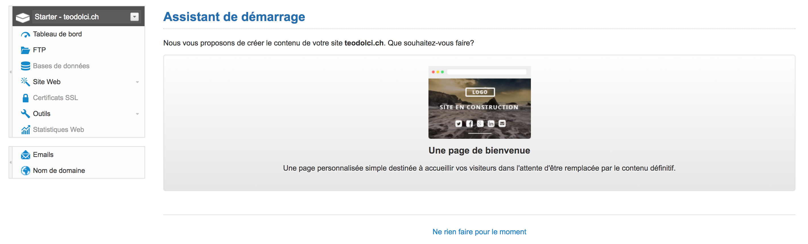
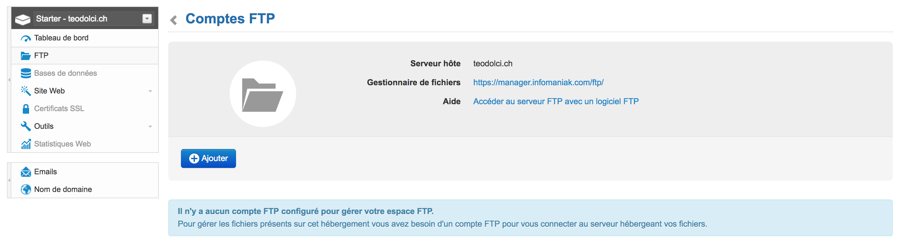
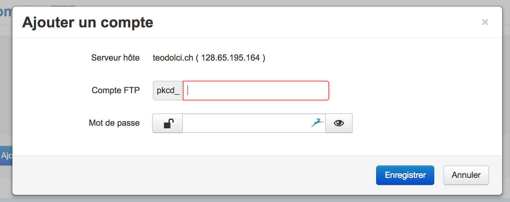
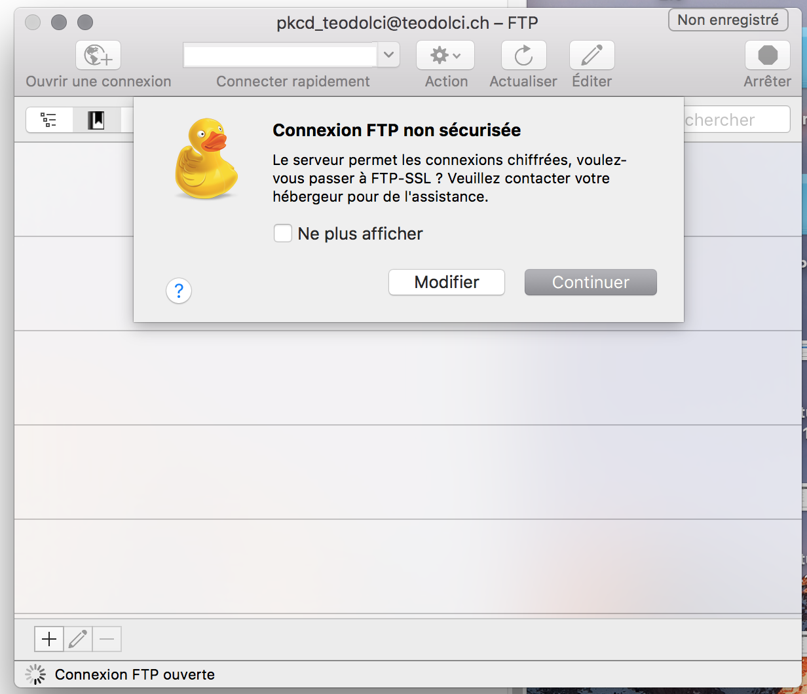

Le **FTP** est un protocole web (File Transfer Protocol) permettant d’envoyer des fichiers vers le serveur. C'est un très ancien protocole, remontant à [1971](https://tools.ietf.org/html/rfc265). 

Aujourd'hui, on préfère utiliser le protocole **SFTP**, offrant un transfer sécurisé. La transmission des codes d'accès est ainsi cryptée, ce qui évitera que votre mot de passe se fasse pirater.

De nombreux clients FTP existent, mais ils partagent globalement les mêmes fonctionalités: [Interarchy](https://nolobe.com/interarchy/), [Transmit](https://panic.com/transmit/), [ForkLift](http://www.binarynights.com/forklift/)... Dans le cadre de ce cours, nous recommandons d'utilier **[Cyberduck](https://cyberduck.io/)**.

**[Cyberduck](https://cyberduck.io/)** est un gestionnaire FTP / SFTP gratuit et open-source, permettant de naviguer dans l'arborescence de votre serveur web, de créer des signets, et éditer (avec prudence) des fichiers directement sur le serveur. Cyberduck utilise le trousseau de MacOS pour conserver les mot de passe.

Vous pouvez le télécharger sous [https://cyberduck.io/](https://cyberduck.io/). Attention à cliquer sur le bon lien de téléchargement!

À noter que certains éditeurs de code permettent de synchroniser directement les fichiers au moment de la sauvegarde (Coda, Espresso, Dreamweaver... ou Atom [avec des extensions](https://atom.io/packages/search?q=ftp)), ce qui vous évite de devoir passer par le client FTP.

## Utilisation de Cyberduck

À l'ouverture d'une nouvelle connexion, CyberDuck vous présente toute une liste de protocoles. Selon ce qu'offre votre hébergeur, choisissez **SFTP**, ou **FTP-SSL** (ou en dernier recours FTP).

Vous devrez renseigner les informations suivantes:

* Adresse du serveur (il s'agit souvent de votre nom de domaine)
* Utilisateur
* Mot de passe

### Utiliser Cyberduck avec un hébergement Infomaniak

Voici où trouver les réglages FTP dans Infomaniak:

## Autres méthodes de mise en ligne

### SCP (Secure Copy)

Il s'agit d'un outil que l'on utilise en ligne de commande (depuis le terminal), pour transmettre des fichiers vers un serveur. Tout comme le SFTP, le SCP utilise le protocole de communication SSH (Secure Shell).

### Avec GIT

Il est possible d'utiliser GIT pour déployer du code vers des serveurs en ligne. Il faut pour cela que votre hébergeur supporte l'outil GIT. 

Voir l'article [Using Git for Website Deployment](http://sheelahb.com/blog/using-git-for-website-deployment/) (par Sheelah Brennan) pour un exemple d'application.

### Services de déploiement

Il existe divers services de déploiement qui permettent d'envoyer le code depuis un dépôt (p.ex. Github ou Bitbucket) vers votre serveur d'hébergement. Des exemples sont: 

* [Beanstalk](https://beanstalkapp.com/)
* [deploybot](https://deploybot.com/)
* [deployHQ](https://www.deployhq.com/)
* [FTPloy](http://ftploy.com/)

Pour plus d'explications: 

* Lire [Stop deploying websites the hard way!](https://medium.com/@adammccombs/stop-deploying-websites-the-hard-way-2c499eab85ed) par Adam McCombs.
* Visionner la conférence [Industrialiser ses projets WordPress](https://wordpress.tv/2014/03/10/amaury-balmer-industrialiser-son-ou-ses-projets-wordpress/) par Amaury Balmer (WordCamp Paris 2014)